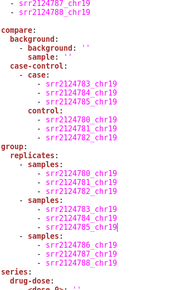

.. _tutorial-diffexp:

========================
Differential expressions
========================

In this tutorial we will learn how to preform differential expressions. We will get familiar
with concepts *sample* and *collection*. We will create a collection and add samples to that 
collection. Then we will learn how to quantify bam files using *cuffdiff* and use the results
to run *cuffnorm* expression and *cuffdiff* differential expression.

Samples
=======

So far we have been intruduced to *process* and data concepts. Next in line is the `sample`_
concept. Sample represents a biological entity. It is a sequence of data objects and typically
contains raw reads, aligned reads and expressions. When a data object that represents a biological 
sample is uploaded, a sample is automatically created. A data object can belong to only one sample.

.. _sample: http://resdk.readthedocs.io/en/latest/ref.html#resdk.resources.Sample

Now let's see which samples are already on the server (and we have permission to see):

.. code-block:: python

	res.sample.all()

and again use `filters`_ to find samples prepared for this tutorial:

.. _filters: http://resdk.readthedocs.io/en/latest/ref.html#resdk.ResolweQuery

.. code-block:: python

	res.sample.filter(name__endswith='chr19', created__date='2017-06-06')

We can `get`_ one of the queried samples and inspect it:

.. _get: http://resdk.readthedocs.io/en/latest/ref.html#resdk.ResolweQuery.get

.. code-block:: python

	# Get the sample
	sample = res.sample.get(187)

	# All data objects in the sample
	sample.data

.. Note::

	Samples, genome file (FASTA) and annotation file (GTF) used in this tutorial were obtained from `here`_.
	Sample information can also be found with ReSDK (only if the sample is annotated):

	.. code-block:: python

		sample.descriptor
	  
	.. _here: https://www.ncbi.nlm.nih.gov/geo/query/acc.cgi?acc=GSE71234

	All files (i.e. all data objects) were later cropped to 19th mice cromosome which is the shortest of the
	mice chromosomes. This was done so that the processes used in this tutorial finish quickly.

Collections
===========

These queried biological samples are all part of the same experiment. It would be great if we had
a way to connect wanted samples together. Luckily we have a way and not just one but two. One is
called a `collection`_. It is a working group of samples. It usually contains samples and their
data but may also contain other data objects like analysis results (e.g., differential expressions)
or data whose sample is not yet inside the collection. It is important to know that if a collection
contains a sample it automatically contains it's data but not the other way around. It may contain
data but not the sample to which this data belongs. 

.. _collection: http://resdk.readthedocs.io/en/latest/ref.html#resdk.resources.Collection

Now that we know what a collection is, let us create one:

.. code-block:: python

	collection = res.collection.create(name='Tutorial: <First and Last Name>')

where instead of <First and Last Name> you insert your name. We will now add queried samples to
our new collection:

.. code-block:: python

	samples = res.sample.filter(name__endswith='chr19', created__date='2017-06-06')

	collection.add_samples(*samples)  

All our samples are now added to the collection. We can see the list of samples in a collection
and also if a selected sample is in any collection and in which ones:

.. code-block:: python
	
	# List of samples in a collection
	collection.samples

	# Collections in which a sample is
	sample.collections

.. warning::

	The tutorial collection you have just created is for ReSDK training only and will be
	removed from the server in a month. 

In the first tutorial (Getting Started) we ran HISAT2 aligment process on one of our samples.
Now we want to run HISAT2 process on all of our samples at once. Since they are now all in the
same collection, this can be easily accomplished by running HISAT2 on the whole collection:

.. code-block:: python

	# Get genome data object for the alignment
	genome = res.data.get(1488)

	# Run hisat2 on a collection
	collection.run_hisat2(genome)

.. note::

	Hisat2 can be run on different entities: data object, sample, collection, relation.

Relations
=========

We have mentioned that there are two ways of connecting samples and got familiar with the
first one which is a collection. The second one is a `relation`_. It is exactly what its name
implies — relation between samples. Its concept is a bit different to that of a collection.
First difference is that a relation can only contain samples and cannot contain data. It
is essentially a finer grouping of samples. There are three types of relations — 'compare',
'group' and 'series'. In this tutorial we will cover 'compare' (usually used for case-control or
sample-background) and 'group' relations (usually used for replicates). 'Series' relations are
usually used for time-series.        

.. _relation: http://resdk.readthedocs.io/en/latest/ref.html#resdk.resources.Relation 

The simplest way to create relations is to download a  relations template from a collection,
define relations and finally apply it to the server by importing it. We will now download the
template (YAML file):

.. code-block:: python

	collection.export_relations()

The file has been downloaded to your working directory. When you open it in text editor you will
see that creating sample relations is nicely explained. However we will go through creating 'group'
replicates relations and 'compare' case-control relation. Following grouping of the samples is
totally arbitrary and has no biological background. It is just a showcase of how to create relations.
You may decide to group samples differently and still continue with the totorial.

Scrolling down in the YAML file will bring you to the list of samples in the collection. These are
the samples available for constructing relations. We will now show how to create a 'group' replicates
relations and a 'compare' case-control relation:

We have defined relations between samples. Save the file and apply the changes by importing:

.. code-block:: python

	collection.import_relations()

We can now check what we have created:

.. code-block:: python

	# Get the latest meta data from the server
	collection.update()

	# All relations in our collection
	collection.relations

We are now ready to run some expressions and differential expressions analysis.

Cuffquant, Cuffnorm and Cuffdiff
================================

Before we get to *cuffnorm* and *cuffdiff* analysis we will run *cuffquant*. This will save
us some time later on because *cuffnorm* and *cuffdiff* will recieve quantified inputs insted of
BAM files. For any of these analysis we will also need an appropriate annotation file (GTF, GFF).
We can query and get it:

.. code-block:: python

	res.data.filter(type='data:annotation:gtf', created__date='2017-06-06') 
  
	annotation = res.data.get(1489)

Let us now run *cuffquant* on all the samples in our *collection*:

.. code-block:: python

	collection.run_cuffquant(annotation)

.. note::

	Cuffquant can be run on different entities: sample, collection, relation.
	It can also be run on a list of entities.

We can now continue with *cuffnorm*. It can also be run on a collection and it will automatically
recognize all the 'group' relations we have imported earlier:

.. code-block:: python

	collection.run_cuffnorm(annotation)

We can now inpect *cuffnorm* results:

.. code-block:: python

	# Get the latest meta data from the server
	collection.update()

	# Query cuffnorm data object
	collection.data.filter(type='data:expressionset:cuffnorm')

	# Get cuffnorm data object
	cuffnorm = collection.data.get(<id of the selected data object>)

	# Files available for download
	cuffnorm.files()

We can download any of these files. We will now download the boxplot file to our working directory:

.. code-block:: python

	cuffnorm.download('cuffnorm_exprs_boxplot.pdf')

.. note::

	Cuffnorm can be run on a relation or a collection.
	It can also be run on a list samples, relations or collections.

We will now run *cuffdiff* on our collection. It will automatically recognize all 'compare'
relations we have imported earlier:

.. code-block:: python

	collection.run_cuffdiff(annotation)

Although we are working with small data objects, *cuffdiff* may take a couple of minutes to
finish processing. We can check the status of the process:

.. code-block:: python

	# Get the latest meta data from the server
	collection.update()

	# Query cuffdiff data object
	collection.data.filter(type='data:differentialexpression:cuffdiff')

	# Get cuffdiff data object
	cuffdiff = collection.data.get(<id of the selected data object>)

	# Check the status of the process
	cuffdiff.update()
	cuffdiff.status

Inspecting results is done in a similar manner as before with *cuffnorm*:

.. code-block:: python

	# Files available for download
	cuffdiff.files()

	# Download all files to our working directory
	cuffdiff.download()

.. note::

	Cuffdiff can be run on a relation or a collection.
	It can also be run on a list samples, relations or collections.

We have now run several processes on each of our samples and created some new data objects in
each sample. If we remember our first data query on our sample, we only got one data object
and that was reads data object. We have since created many new data objects on our sample:

.. code-block:: python

	sample.data

We have come to the end of Differential expressions tutorial. You are now acquainted with some
powerful concepts (sample, collection and relation) and know how to run differential expressions
(and other processes) on samples that are already on the server. In the next tutorial we will
learn how to work with your own data.
